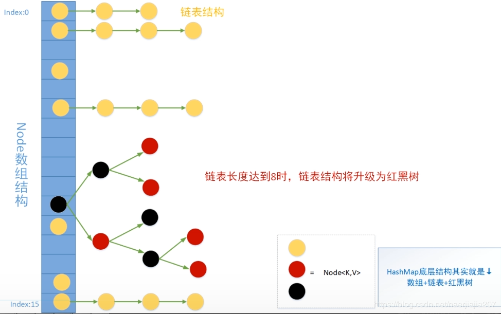
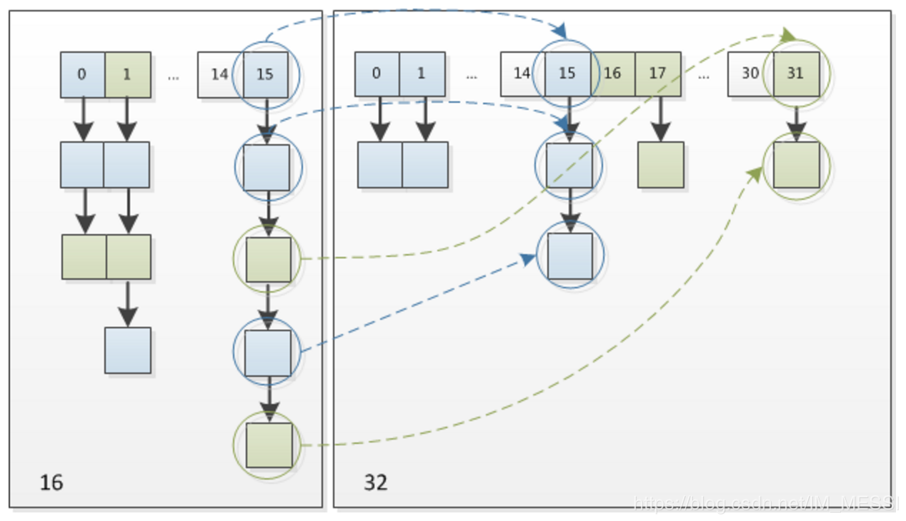

# 1 集合常见问题剖析

## 1.1 集合概述

### 1.1.1 Java集合概念 

Java除了以`Map` 结尾的类之外，其他类都实现自`Collection`接口，并且以`Map`结尾的类都实现了`Map`接口（`SetFromMap` 是`Collection的内部类`）


### 1.1.2 List ,Set,Map 三者的区别？

- `List`（ 对付顺序的好帮手）：存储的元素是有序、可重复的。

- `Set` (注重独一无二的性质)：存储的元素是无序的、不可重复的。

- `Map`（用key搜索的专家）：使用键值对的方式存储，key是无序、不可重复的的，value是无序的，可重复的，每一个键最多映射到一个值。

### 1.1.3 List  

 常用的三个实现类

- `ArrayList` : `ArrayList`  是最常用的List实现类，内部是通过数组实现的，它允许对元素进行快速随机访问。数组的缺点是每个元素之间不能有间隔，当数组大小不满足是需要增加存储能力，就要将已经有数组的数据复制到新数组的存储空间中。当从`ArrayList`的中插入或者删除元素时，需要对数组进行复制。移动，代价比较高，因此它适合随机查找和遍历，不适合插入和删除。

- `Vector`：`Vector`与`Arrary`一样也是通过数组实现的，不同的是它支持线程同步，，即某一时刻只有一个线程能够写`Vector`避免多线程同时写而引起的不一致性，但实现同步需要很高的花费，因此它访问比`ArrayList`慢。

- `LinkedList`：`LinkedList` 使用链表结构存储数据的，很适合数据的动态插入和删除，随机访问和遍历速度比较慢。另外，他还提供了List接口中没有定义的方法，专门用于操作表头和表尾元素，可以当做堆、栈和双向队列使用。

### 1.1.4 Set

Set注重独一无二的性质，该体系集合用于存储无序（存入和取出的顺序不一定相同）元素，值不能重复。对象的相等性本质是对象`HashCode`值（`java`是依据对象的内存地址计算出此序列号）判断的，如果想要让两个不同的对象视为相等的，就必须覆盖`Object`的`hashCode`方法和`equals`方法.

- `HashSet`: 基于哈希表实现，存入数据是按照哈希值，所以并不是按照存入的顺序排序，为保证存入的唯一性，存入元素哈希值相同时，会使用`equals`方法比较，如果比较出不同就放入同一个哈希桶里。
- `TreeSet`： 基于红黑树实现，支持有序性操作，每一个增加一个对象都会进行排序，将对象插入的二叉树指定位置。
- `LinkHashedSet`(`HashSet`+`LinkedHashMap`)：继承于`HashSet`又是基于`LinkedHashMap`来实现的，具有`HashSet`的查找效率。 

### 1.1.5 Map

1. `HashMap`: 根据键的`hashCode`值存储数据，大多数情况下可以直接定位到它的值，因而具有很快的访问速度，但遍历顺序却是不确定的，`HashMap`非线程安全，底层实现为数组+链表+红黑树。
2. `ConcurrentHashMap` ：**支持并发模式操作的`HashMap`**,在`jdk1.7`和`jdk1.8`实现线程安全的方式不同。
3. `HashTable`: `HashTable` 是遗留类，不建议使用，但多映射的常用功能与`HashMap` 类似，通过`synchronized`把整个（table）表锁住来实现线程安全的，效率十分低下。
4. `TreeMap`: 红黑树实现，可排序，需要对一个有序的key集合进行遍历时建议使用。
5. `LinkedHashMap`: 是`HashMap`的一个子类，增加一条双向链表，从而可以保存记录的插入顺序，再用`Iterator`遍历 `LinkedHashMap`时，先得到的记录肯定是先插入的，也可以在构造时带参数，按照访问次序排序。

 ### 1.1.6  如何选用集合

​     根据集合的特点来选用，比如我们需要根据键值获取到元素值时就选用`Map` 接口下的集合，需要排序时选择`TreeMap` ,不需要排序选择`HashMap`，需要保证线程安全就选用`ConcurrentHashMap`.

### 1.1.7 有哪些集合是线程安全的？怎么解决呢？

  我们常用`ArrayList`,`LinkedList`,`HashMap`,`TreeSet`,`PrioritQueue`都是线程不安全的，解决办法很简单，可以使用线程安全的集合来替代。（java.util.concurrent）

1. `ConcurrentHashMap` : 可以看作是线程安全的`HashMap` 
2. `CopyOnWriteArrayList`可以看作是线程安全的`ArrayList`，在读多写少的场合性能非常好，远远好于`Vector`.
3. `ConcurrentLinkedQueue`：高效的并发队列，使用链表实现，可以看做一个线程安全的`LinkedList`,这是一个非阻塞队列。
4. `BlockingQueue`：这是一个接口，jdk 内部通过链表、数组等方式实现了一个线程安全的`LinkedList`,这时一个非阻塞队列。
5. `ConcurrentSkipListMap`： 跳表的实现。这是一个`Map`，使用跳表的数据结构进行快速查找。

## 1.2  Collection 子接口 List

 ### 1.2.1 ArrayList和Vector的区别？

1. Arraylist是list的主要实现类，底层使用Object[]存储，适用于频繁的查找工作，线程不安全；

2. Vector是List的古老实现类，底层使用Object[]存储，线程安全的（在读的同时写入不一定安全）

   

### 1.2.2 ArrayList与LinkedList区别？

1. 是否线程安全：都是不同步的，也就是不保证线程安全；

2. 底层数据结构：`ArrayList` 底层使用**object类型的数组**；`LikedList`底层使用的是**双向链表**数据结构（jdk1.6之前为循环链表）
3. 插入和删除是否受元素位置的影响：①  `ArrayList`采用数组存储，所以插入和删除元素的时间复杂度受元素的位置的影响。
3. 插入和删除是否受元素位置的影响：①  `ArrayList`采用数组存储，所以插入和删除元素的时间复杂度受元素的位置的影响。比如：执行add(E e)方法的时候，`ArrayList` 会默认在将指定的元素追加到此列表的末尾，这种情况的话(add(int index, E element) )时间复杂度就为O(n-i)。因此在进行上述操作的时候，`ArrayList` 会默认在将指定的元素追加到此列表的末尾，这种情况时间复杂度就是o(1)。但是如果要在指定位置i插入和删除元素的话（add(int index,E element)）时间复杂度就为O(n-i)。因为在进行上述操作的时候集合中第i和第i个元素之后的(n-i)个元素都要执行向后位/向前移一位的操作。② **`LinkedList` 采用链表存储，所以对于add(E e)方法插入，删除元素的时间复杂度不受元素位置的影响，近似O(1),如果是要在指定位置i插入和删除元素的话((add(int index,E element)))时间复杂度近似为o(n)因为需要先移动到指定位置再插入**。

4. 是否支持快速随机访问：`LinkedList` 不支持高效的随机元素访问，而`Arraylist`支持，快速随机访问就是通过元素的序号快速获取元素对象（对应get(int index)方法）。

5. 内存空间：ArrayList的空间浪费主要体现在list列表的结尾会预留一定的容量空间，而LinkedList的空间花费则体现在它的每一个元素都需要消耗比ArrayList更多的空间（应为要存放直接后继和直接前驱以及数据）

   

## 1.3 Collection子接口之Set

   ### 1.3.1 比较 HashSet、LinkedHashSet 和 TreeSet 三者的异同

HashSet 是 Set 接口的主要实现类 ，HashSet 的底层是 HashMap，线程不安全的，可以存储 null 值；

LinkedHashSet 是 HashSet 的子类，能够按照添加的顺序遍历；

TreeSet 底层使用红黑树，能够按照添加元素的顺序进行遍历，排序的方式有自然排序和定制排序。

## 1.4. Map 接口

   ### 1.4.1. HashMap和Hashtable的区别

1. 线程是否安全：`HashMap`线程不安全；`HashTable`线程安全，内部的方法基本都经过`Synchronized`修饰，如果要保证线程的安全推荐使用ConcurrentHashMap;
2. 效率：因为线程安全的问题，HashMap要比HashTable效率高一点，并且HashTable基本被淘汰
3. 对Null key 和Null Value 的支持：HashMap 中，null 可以作为键，这样的键只有一个，可以有一个或多个键所对应的值为 null。。但是在 HashTable 中 put 进的键值只要有一个 null，直接抛出 NullPointerException。 
4. **初始容量大小和每次扩充容量大小的不同 ：** ①创建时如果不指定容量初始值，Hashtable 默认的初始大小为11，之后每次扩充，容量变为原来的2n+1。HashMap 默认的初始化大小为16。之后每次扩充，容量变为原来的2倍。②创建时如果给定了容量初始值，那么 Hashtable 会直接使用你给定的大小，而 HashMap 会将其扩充为2的幂次方大小；
5. **底层数据结构：** JDK1.8 以后的 HashMap 在解决哈希冲突时有了较大的变化，当链表长度大于阈值（默认为8）时，将链表转化为红黑树，以减少搜索时间。Hashtable 没有这样的机制。

### 1.4.2 [HashMap和ConcurrentHashMap的区别](  https://juejin.cn/post/6844903641866846222)

 ### 1.4.3 HashMap 和 HashSet 区别

​     HashSet的底层实现其实是HashMap,HashSet的源码非常非常少，除了`clone()`、`writeobject()`、`readobject()`是HashSet自己不得不实现的，其他方法都是直接调用HashMap中的方法。

| HashMap                   | HashSet                                                      |
| ------------------------- | ------------------------------------------------------------ |
| 实现了Map接口             | 实现Set接口                                                  |
| 存储键值对                | 仅存储对象                                                   |
| 调用put()向map中添加元素  | 调用add()方法向Set中添加元素                                 |
| HashMap使用键计算HashCode | HashSet使用成员对象来计算hashcode值，对于两个对象来说hashcode可能相同，所以equals()方法用来判断对象的相等性 |

### 1.4.4. HashSet 如何检查重复

当你把对象加入`HashSet`时，HashSet 会先计算对象的`hashcode`值来判断对象加入的位置，同时也会与其他加入的对象的 hashcode 值作比较，如果没有相符的 hashcode，HashSet 会假设对象没有重复出现。但是如果发现有相同 hashcode 值的对象，这时会调用`equals()`方法来检查 hashcode 相等的对象是否真的相同。如果两者相同，HashSet 就不会让加入操作成功。（摘自我的 Java 启蒙书《Head fist java》第二版）

**hashCode()与 equals()的相关规定：**

1. 如果两个对象相等，则 hashcode 一定也是相同的
2. 两个对象相等,对两个 equals 方法返回 true
3. 两个对象有相同的 hashcode 值，它们也不一定是相等的
4. 综上，equals 方法被覆盖过，则 hashCode 方法也必须被覆盖
5. hashCode()的默认行为是对堆上的对象产生独特值。如果没有重写 hashCode()，则该 class 的两个对象无论如何都不会相等（即使这两个对象指向相同的数据）。

**== 与 equals 的区别**

对于基本类型来说，== 比较的是值是否相等；

对于引用类型来说，== 比较的是两个引用是否指向同一个对象地址（两者在内存中存放的地址（堆内存地址）是否指向同一个地方）；

对于引用类型（包括包装类型）来说，equals 如果没有被重写，对比它们的地址是否相等；如果 equals()方法被重写（例如 String），则比较的是地址里的内容。

### 1.4.5  HashMap 的长度为什么是2的幂次方

​    HashMap为了存取高效，在根据hash值寻址时要尽量减少碰撞，要尽量把数据分配均匀，采用了位与运算hash&(length-1)，当length为2的n次方时，能均匀分布减少碰撞。

### 1.4.6 什么是 HashMap 的加载因子？加载因子为什么是 0.75？

- 判断什么时候进行扩容的，假如加载因子是 0.5，HashMap 的初始化容量是 16，那么当 HashMap 中有 16*0.5=8 个元素时，HashMap 就会进行扩容。

  这其实是出于容量和性能之间平衡的结果：

  * 当加载因子设置比较大的时候，扩容的门槛就被提高了，扩容发生的频率比较低，占用的空间会比较小，但此时发生Hash冲突的几率就会提升，因此需要更复杂的数据结构来存储元素，这样对元素的操作时间就会增加，运行效率也会因此降低；
  * 而当加载因子值比较小的时候，扩容的门槛会比较低，因此会占用更多的空间，多次扩容也会影响性能。
  * HashMap的容量有一个固定的要求就是一定是2的幂次方。所以，如果负载因子是3/4的话，那么和capacity的乘积结果就可以是一个整数。

  所以综合了以上情况就取了一个 0.5 到 1.0 的平均数 0.75 作为加载因子。

### 1.4.7SynchronizedMap和ConcurrentHashMap有什么区别？

   **SynchronizedMap**一次锁住整张表来保证线程安全，所以每次只能有一个线程来访为map.**ConcurrentHashMap**使用**分段锁**来保证在多线程下的性能。SynchronizedMap中则是一次锁住一个桶。ConcurrentHashMap默认将hash表分为16个桶，诸如get,put,remove等常用操作只锁当前需要用到的桶。这样，原来只能一个线程进入，现在却能同时有16个写线程执行，并发性能的提升是显而易见的。另外ConcurrentHashMap使用了一种不同的迭代方式。在这种迭代方式中，当iterator被创建后集合再发生改变就不再是抛出ConcurrentModificationException，取而代之的是在改变时new新的数据从而不影响原有的数据，iterator完成后再将头指针替换为新的数据，这样iterator线程可以使用原来老的数据，而写线程也可以并发的完成改变。

#  1.5 源码分析

##  ArrayList

 ###  1.5.1  定义

```java
public class ArrayList<E> extends AbstractList<E>  implements List<E>, RandomAccess, Cloneable, java.io.Serializable
```

​    `ArrayList`是基于数组实现的，所以支持快速随机访问。继承自`AbstractList`实现了`List`。他是一个数组队列，提供了相关的添加、删除、修改，遍历等功能。

### 1.5.2  `ArrayList`源码解析

   #### 1. 三种构造方式初始化

```java
     /**
     * Default initial capacity
     * 默认初始化容量大小.
     */
    private static final int DEFAULT_CAPACITY = 10;
     /**
     * Shared empty array instance used for empty instances.
     * 用于空实例的共享空数组实例
     */
    private static final Object[] EMPTY_ELEMENTDATA = {};
     
    private static final Object[] DEFAULTCAPACITY_EMPTY_ELEMENTDATA = {};

   /**
     * Constructs an empty list with an initial capacity of ten.
     * 默认无参构造，第一次执行add()里的ensureCapacityInternal方法时才会初始化为十
     */
    public ArrayList() {
        this.elementData = DEFAULTCAPACITY_EMPTY_ELEMENTDATA;
    }
	
   /**
     * 带初始容量参数的构造函数。（用户自己指定容量）
     */
    public ArrayList(int initialCapacity) {
        if (initialCapacity > 0) {//初始容量大于0
            //创建initialCapacity大小的数组
            this.elementData = new Object[initialCapacity];
        } else if (initialCapacity == 0) {//初始容量等于0
            //创建空数组
            this.elementData = EMPTY_ELEMENTDATA;
        } else {//初始容量小于0，抛出异常
            throw new IllegalArgumentException("Illegal Capacity: "+
                                               initialCapacity);
        }
    }

   /**
    *构造包含指定collection元素的列表，这些元素利用该集合的迭代器按顺序返回
    *如果指定的集合为null，throws NullPointerException。 
    */
     public ArrayList(Collection<? extends E> c) {
        elementData = c.toArray();
        if ((size = elementData.length) != 0) {
            // c.toArray might (incorrectly) not return Object[] (see 6260652)
            if (elementData.getClass() != Object[].class)
                elementData = Arrays.copyOf(elementData, size, Object[].class);
        } else {
            // replace with empty array.
            this.elementData = EMPTY_ELEMENTDATA;
        }
    }

```

   以无参构造方法创建`ArrayList`时，实际上初始化赋值是一个空数组。当真正对数组添加元素操作时（执行add()方法），才会分配容量，，数组扩为10。

 #### 2  `ArrayList`扩容机制

1. add方法

   ```java
       /**
        * 将指定的元素追加到此列表的末尾。 
        */
       public boolean add(E e) {
         //添加元素之前，先调用ensureCapacityInternal方法，实现扩容
           ensureCapacityInternal(size + 1);  // Increments modCount!!
           //这里看到ArrayList添加元素的实质就相当于为数组赋值
           elementData[size++] = e;
           return true;
       }
   
       //得到最小扩容量
       private void ensureCapacityInternal(int minCapacity) {
           if (elementData == DEFAULTCAPACITY_EMPTY_ELEMENTDATA) {
                 // 获取默认的容量和传入参数的较大值
               minCapacity = Math.max(DEFAULT_CAPACITY, minCapacity);
           }
   		 //调用此方法判断是否需要扩容
           ensureExplicitCapacity(minCapacity);
       }
   
      //判断是否需要扩容
       private void ensureExplicitCapacity(int minCapacity) {
           modCount++;
   
           // 第一次minCapacity为10， elemeneData.length还是0，条件为真
           //进行扩容，10赋值给了minCapacity。所以第二次为false
           if (minCapacity - elementData.length > 0)
               //调用grow方法进行扩容，调用此方法代表已经开始扩容了
               grow(minCapacity);
       }
   ```

   2 `grow` 方法

   ```java
   
       /**
        * 要分配的最大数组大小
        */
   
       private static final int MAX_ARRAY_SIZE = Integer.MAX_VALUE - 8;
   
   
        /**
          * ArrAyList扩容的核心方法
          * 
          */
   
       private void grow(int minCapacity) {
               // oldCapacity  旧容量
               int oldCapacity = elementData.length;
               // newCapacity  新容量
               //oldCapacity 右移一位，位运算的速度远远快于整除运算，整句运算式的
               // 结果就是将新容量更新为旧容量的1.5倍，oldCapacity/2对等oldCapacity >> 1
               int newCapacity = oldCapacity + (oldCapacity >> 1);
               //检查新容量是否大于最小需要容量，若还是小于最小需要容量，
               //那么就把最小需要容量当作数组的新容量，
               if (newCapacity - minCapacity < 0)
                   newCapacity = minCapacity;
               // 如果新容量大于 MAX_ARRAY_SIZE,进入(执行) `hugeCapacity()` 方法来比较     			// minCapacity 和 MAX_ARRAY_SIZE，
               //如果minCapacity大于最大容量，则新容量则为`Integer.MAX_VALUE`，否则，新容量大小             //则为 MAX_ARRAY_SIZE 即为 `Integer.MAX_VALUE - 8`。
               if (newCapacity - MAX_ARRAY_SIZE > 0)
                   newCapacity = hugeCapacity(minCapacity);
               // minCapacity is usually close to size, so this is a win:
               elementData = Arrays.copyOf(elementData, newCapacity);
           }
   ```

    oldCapacity + (oldCapacity >> 1)  ，`ArrayList`每次扩容为它原有的1.5倍，奇数会去掉小数位

   > ">>"（移位运算符）：>>1 右移一位相当于除2，右移n位相当于除以 2 的 n 次方。这里 oldCapacity 明显右移了1位所以相当于oldCapacity /2。对于大数据的2进制运算,位移运算符比那些普通运算符的运算要快很多,因为程序仅仅移动一下而已,不去计算,这样提高了效率,节省了资源 

   

 ## CopyOnWriteArrayList

​	1.5.1 定义

```javascript
public class CopyOnWriteArrayList<E>
    implements List<E>, RandomAccess, Cloneable, java.io.Serializable 
```

concurrent 并发包下的类，是ArrayList的线程安全解决方案， 通过ReentrantLock获取对象锁的方式来实现线程安全。

​    1.5.2 源码解析

```java
 public boolean add(E e) {
        final ReentrantLock lock = this.lock;//重入锁 
         //加锁
        lock.lock();
        try {
            Object[] elements = getArray();
            int len = elements.length;
            //拷贝到新数组
            Object[] newElements = Arrays.copyOf(elements, len + 1);
            newElements[len] = e;
            setArray(newElements);  //指向新数组
            return true;
        } finally {
            lock.unlock();
        }
    }
```

  优点：1.保证数据完整性，2.解决多线程遍历迭代的问题

  缺点：1.耗内存（写时复制），2.实时性不高

  使用场景： 读多写少，集合不大时适用

## HashMap

### 1.5.1.整体原理分析

HashMap类中有一个非常重要的字段，就是Node[]table，即哈希桶数组

```java
static class Node<K,V> implements Map.Entry<K,V> {
        final int hash;
        final K key;
        V value;
        Node<K,V> next;

        Node(int hash, K key, V value, Node<K,V> next) {
            this.hash = hash;
            this.key = key;
            this.value = value;
            this.next = next;
        }
```

 Node是HashMap的一个内部类，实现了Map.Entry接口，本质是就是一个映射(键值对)。 

hash:hashcode经过扰动函数得到的值， 然后通过 `(n - 1) & hash` 判断当前元素存放的位置，如果当前

位置存在hash和key值不相同的元素就使用拉链法解决冲突。

**“拉链法”** 就是：将链表和数组相结合。也就是说创建一个链表数组，数组中每一格就是一个链表。若遇到哈希冲突，则将冲突的值加到链表中即可。 

Node<K,V> next：next就是用于链表的指向。

所谓**扰动函数**指的就是 HashMap 的 hash 方法。使用 hash 方法也就是扰动函数是为了防止一些实现比较差的 hashCode() 方法 换句话说使用扰动函数之后可以减少碰撞。 



### 1.5.2 put()源码分析  （map.put("a","b")整个流程）

```java
 public V put(K key, V value) {
        return putVal(hash(key), key, value, false, true);
    }

  
    final V putVal(int hash, K key, V value, boolean onlyIfAbsent,
                   boolean evict) {
        // tab：引用当前hashmap的散列表
        //  p : 当前散列表的元素
        //  n : 散列表数组长度
        //  i : 路由寻址结果
        Node<K,V>[] tab; Node<K,V> p; int n, i;
         //step1:判断当前散列表是否为空，空的就需要初始化（resize 中会判断是否进行初始化
         //table未初始化或者长度为0，进行扩容（采用了延时初始化，第一次put才会初始化散列表。）
        if ((tab = table) == null || (n = tab.length) == 0)
            n = (tab = resize()).length;
        //step2 根据key的hash值寻址，找到数组中这个地址的元素，再判断这个元素是否为空，
        //为空就把put的元素存放在该位置
        //寻址找到的桶位为null
        //(n - 1) & hash 确定元素存放在哪个桶中，桶为空，新生成结点放入桶中(此时，这个结点是放在数组中)
        if ((p = tab[i = (n - 1) & hash]) == null)
            tab[i] = newNode(hash, key, value, null);
        // 寻址找到的桶位已经存在元素
        else {
            Node<K,V> e; K k;
           //step3:step2的判断，如果不为空，就比较该元素的key的hash值和要存入的key的hash值是否相等，
            if (p.hash == hash &&
                ((k = p.key) == key || (key != null && key.equals(k))))
                 // 完全一致
            	//e:找到的一个与当前要插入的元素一直的元素
                e = p;
            // hash值不相等，即key不相等；且为红黑树结点
            // step3的判断，如果不相等，则判断数组中的这个元素是否为一个树节点，如果是，那就要按照红黑树的方式写入数据。
            else if (p instanceof TreeNode)
                // 放入树中
                e = ((TreeNode<K,V>)p).putTreeVal(this, tab, hash, key, value);
            // 为链表结点
            else {
               // step3的判断，如果不相等，并且数组中的这个元素不是一个树节点，那么就是链表，
               // 则将当前put的key、value 封装成一个新节点写入到当前元素链表的最后面。
                // 在链表最末插入结点
                for (int binCount = 0; ; ++binCount) {
                    if ((e = p.next) == null) {
                        // 在尾部插入新结点
                        p.next = newNode(hash, key, value, null);
                         // 接着判断当前链表的大小是否大于预设的阈值，大于时就要转换为红黑树。
                        if (binCount >= TREEIFY_THRESHOLD - 1) // -1 for 1st
                            treeifyBin(tab, hash);
                        break;
                    }
                    // 如果在遍历过程中找到与put的key 相同时直接退出遍历。
                    // 判断链表中结点的key值与插入的元素的key值是否相等
                    if (e.hash == hash &&
                        ((k = e.key) == key || (key != null && key.equals(k))))
                         // 相等，跳出循环
                        break;
                     // 用于遍历桶中的链表，与前面的e = p.next组合，可以遍历链表
                    p = e;
                }
            }
            // 如果 e != null 就相当于存在相同的 key,那就需要将put的值覆盖数组元素相同的值。
            // 表示在桶中找到key值、hash值与插入元素相等的结点
            if (e != null) { // existing mapping for key
                // 记录e的value
                V oldValue = e.value;
                 // onlyIfAbsent为false或者旧值为null
                if (!onlyIfAbsent || oldValue == null)
                    //替换
                    e.value = value;
                afterNodeAccess(e);
                return oldValue;
            }
        }
        // 结构性修改
        ++modCount;
          // 实际大小大于阈值则扩容
        // 最后判断是否需要进行扩容。
        if (++size > threshold)
            resize();
         // 插入后回调
        afterNodeInsertion(evict);
        return null;
    }

```

```text
1. 先判断散列表是否没有初始化或者为空，如果是就扩容
2. 根据键值 key 计算 hash 值，得到要插入的数组索引 
3. 判断要插入的那个数组是否为空：
   4. 如果为空直接插入。
   5. 如果不为空，判断 key 的值是否是重复（用 equals 方法）：
      	1. 如果是就直接覆盖
      	2. 如果不重复就再判断此节点是否已经是红黑树节点：
           	1. 如果是红黑树节点就把新增节点放入树中
           	2. 如果不是，就开始遍历链表：
                	1. 循环判断直到链表最底部，到达底部就插入节点，然后判断是否大于链表长度是否大于8：
                     1. 如果大于8就转换为红黑树
                     2. 如果不大于8就继续下一步
               	2. 到底部之前发现有重复的值，就覆盖。
6. 判断是否需要扩容，如果需要就扩容。
```


### 1.5.3 扩容（resize方法）

  扩容会伴随着一次重新hash分配，并且会遍历hash表中所有的元素，是非常耗时的。在编写程序中，要尽量避免resize。 源码在下面，仔细阅读即可理解此方法。

```java
final Node<K,V>[] resize() {
    Node<K,V>[] oldTab = table;
    int oldCap = (oldTab == null) ? 0 : oldTab.length;
    int oldThr = threshold;
    int newCap, newThr = 0;
    //散列表已经被初始化了，是一次正常扩容
    if (oldCap > 0) {
        // 超过最大值就不再扩充了
        if (oldCap >= MAXIMUM_CAPACITY) {
            threshold = Integer.MAX_VALUE;
            return oldTab;
        }
        // 没超过最大值，就扩充为原来的2倍
        else if ((newCap = oldCap << 1) < MAXIMUM_CAPACITY && oldCap >= DEFAULT_INITIAL_CAPACITY)
            newThr = oldThr << 1; // double threshold：翻倍
    }
     //散列表没有被初始化
    else if (oldThr > 0) // 初始化的容量是已经指定了的
        newCap = oldThr;
    else { 
        // 默认初始化容量
        newCap = DEFAULT_INITIAL_CAPACITY;//16
        newThr = (int)(DEFAULT_LOAD_FACTOR * DEFAULT_INITIAL_CAPACITY);//12
    }
    // 计算新的resize上限
    if (newThr == 0) {
        float ft = (float)newCap * loadFactor;
        newThr = (newCap < MAXIMUM_CAPACITY && ft < (float)MAXIMUM_CAPACITY ? (int)ft : Integer.MAX_VALUE);
    }
    threshold = newThr;
    @SuppressWarnings({"rawtypes","unchecked"})
        Node<K,V>[] newTab = (Node<K,V>[])new Node[newCap];
    table = newTab;
    if (oldTab != null) {
        // 把每个bucket都移动到新的buckets中
        for (int j = 0; j < oldCap; ++j) {
            Node<K,V> e;
            //当前桶位有数据，但不清楚是什么数据。
            if ((e = oldTab[j]) != null) {
                //方便 GC
                oldTab[j] = null;
                //如果是单个元素
                if (e.next == null)
                    newTab[e.hash & (newCap - 1)] = e;
                //如果是红黑树
                else if (e instanceof TreeNode)
                    ((TreeNode<K,V>)e).split(this, newTab, j, oldCap);
                else { //桶位已经形成链表
                    Node<K,V> loHead = null, loTail = null;//低位链表
                    Node<K,V> hiHead = null, hiTail = null;//高位链表
                    Node<K,V> next;
                    do {
                        next = e.next;
                        // 原索引，给低位链表赋值
                        if ((e.hash & oldCap) == 0) {
                            if (loTail == null)
                                loHead = e;
                            else
                                loTail.next = e;
                            loTail = e;
                        }
                        // 原索引+oldCap，给高位链表赋值
                        else {
                            if (hiTail == null)
                                hiHead = e;
                            else
                                hiTail.next = e;
                            hiTail = e;
                        }
                    } while ((e = next) != null);
                    // 原索引放到桶里
                    if (loTail != null) {
                        loTail.next = null;
                        newTab[j] = loHead;
                    }
                    // 原索引+oldCap放到桶里
                    if (hiTail != null) {
                        hiTail.next = null;
                        newTab[j + oldCap] = hiHead;
                    }
                }
            }
        }
    }
    return newTab;
}
```



## ConcurrentHashMap

  使用了 CAS 操作来支持更高的并发度，在 CAS 操作失败时使用内置锁 synchronized。  synchronized只锁定当前链表或红黑二叉树的首节点，这样只要hash不冲突，就不会产生并发，效率又提升N倍。

### 1. 存储结构


可以发现 Java8 的 ConcurrentHashMap  相对于 Java7 来说变化比较大，不再是之前的 **Segment 数组 + HashEntry 数组 + 链表**，而是 **Node 数组 + 链表 / 红黑树**。当冲突链表达到一定长度时，链表会转换成红黑树。

### 2. 初始化 initTable

```java
/**
 * Initializes table, using the size recorded in sizeCtl.
 */
private final Node<K,V>[] initTable() {
    Node<K,V>[] tab; int sc;
    while ((tab = table) == null || tab.length == 0) {
        ／／　如果 sizeCtl < 0 ,说明另外的线程执行CAS 成功，正在进行初始化。
        if ((sc = sizeCtl) < 0)
            // 让出 CPU 使用权
            Thread.yield(); // lost initialization race; just spin
        else if (U.compareAndSwapInt(this, SIZECTL, sc, -1)) {
            try {
                if ((tab = table) == null || tab.length == 0) {
                    int n = (sc > 0) ? sc : DEFAULT_CAPACITY;
                    @SuppressWarnings("unchecked")
                    Node<K,V>[] nt = (Node<K,V>[])new Node<?,?>[n];
                    table = tab = nt;
                    sc = n - (n >>> 2);
                }
            } finally {
                sizeCtl = sc;
            }
            break;
        }
    }
    return tab;
}
```

从源码中可以发现 ConcurrentHashMap 的初始化是通过**自旋和 CAS** 操作完成的。里面需要注意的是变量 `sizeCtl` ，它的值决定着当前的初始化状态。

1. -1  说明正在初始化
2. -N 说明有N-1个线程正在进行扩容
3. 表示 table 初始化大小，如果 table 没有初始化
4. 表示 table 容量，如果 table　已经初始化。

### 3. put

直接过一遍 put 源码。

```java
public V put(K key, V value) {
    return putVal(key, value, false);
}

/** Implementation for put and putIfAbsent */
final V putVal(K key, V value, boolean onlyIfAbsent) {
    // key 和 value 不能为空
    if (key == null || value == null) throw new NullPointerException();
    int hash = spread(key.hashCode());
    int binCount = 0;
    for (Node<K,V>[] tab = table;;) {
        // f = 目标位置元素
        Node<K,V> f; int n, i, fh;// fh 后面存放目标位置的元素 hash 值
        if (tab == null || (n = tab.length) == 0)
            // 数组桶为空，初始化数组桶（自旋+CAS)
            tab = initTable();
        else if ((f = tabAt(tab, i = (n - 1) & hash)) == null) {
            // 桶内为空，CAS 放入，不加锁，成功了就直接 break 跳出
            if (casTabAt(tab, i, null,new Node<K,V>(hash, key, value, null)))
                break;  // no lock when adding to empty bin
        }
        else if ((fh = f.hash) == MOVED)
            tab = helpTransfer(tab, f);
        else {
            V oldVal = null;
            // 使用 synchronized 加锁加入节点
            synchronized (f) {
                if (tabAt(tab, i) == f) {
                    // 说明是链表
                    if (fh >= 0) {
                        binCount = 1;
                        // 循环加入新的或者覆盖节点
                        for (Node<K,V> e = f;; ++binCount) {
                            K ek;
                            if (e.hash == hash &&
                                ((ek = e.key) == key ||
                                 (ek != null && key.equals(ek)))) {
                                oldVal = e.val;
                                if (!onlyIfAbsent)
                                    e.val = value;
                                break;
                            }
                            Node<K,V> pred = e;
                            if ((e = e.next) == null) {
                                pred.next = new Node<K,V>(hash, key,
                                                          value, null);
                                break;
                            }
                        }
                    }
                    else if (f instanceof TreeBin) {
                        // 红黑树
                        Node<K,V> p;
                        binCount = 2;
                        if ((p = ((TreeBin<K,V>)f).putTreeVal(hash, key,
                                                       value)) != null) {
                            oldVal = p.val;
                            if (!onlyIfAbsent)
                                p.val = value;
                        }
                    }
                }
            }
            if (binCount != 0) {
                if (binCount >= TREEIFY_THRESHOLD)
                    treeifyBin(tab, i);
                if (oldVal != null)
                    return oldVal;
                break;
            }
        }
    }
    addCount(1L, binCount);
    return null;
}
```

1. 根据 key 计算出 hashcode 。

2. 判断是否需要进行初始化。

3. 即为当前 key 定位出的 Node，如果为空表示当前位置可以写入数据，利用 CAS 尝试写入，失败则自旋保证成功。

4. 如果当前位置的 `hashcode == MOVED == -1`,则需要进行扩容。

5. 如果都不满足，则利用 synchronized 锁写入数据。

6. 如果数量大于 `TREEIFY_THRESHOLD` 则要转换为红黑树。

### 4. get

get 流程比较简单，直接过一遍源码。

```java
public V get(Object key) {
    Node<K,V>[] tab; Node<K,V> e, p; int n, eh; K ek;
    // key 所在的 hash 位置
    int h = spread(key.hashCode());
    if ((tab = table) != null && (n = tab.length) > 0 &&
        (e = tabAt(tab, (n - 1) & h)) != null) {
        // 如果指定位置元素存在，头结点hash值相同
        if ((eh = e.hash) == h) {
            if ((ek = e.key) == key || (ek != null && key.equals(ek)))
                // key hash 值相等，key值相同，直接返回元素 value
                return e.val;
        }
        else if (eh < 0)
            // 头结点hash值小于0，说明正在扩容或者是红黑树，find查找
            return (p = e.find(h, key)) != null ? p.val : null;
        while ((e = e.next) != null) {
            // 是链表，遍历查找
            if (e.hash == h &&
                ((ek = e.key) == key || (ek != null && key.equals(ek))))
                return e.val;
        }
    }
    return null;
}
```

总结一下 get 过程：

1. 根据 hash 值计算位置。
2. 查找到指定位置，如果头节点就是要找的，直接返回它的 value.
3. 如果头节点 hash 值小于 0 ，说明正在扩容或者是红黑树，查找之。
4. 如果是链表，遍历查找之。

总结：

总的来说 ConcruuentHashMap 在 Java8 中相对于 Java7 来说变化还是挺大的，


最后： 什么是CAS和自选呢？  请看大厂面试题